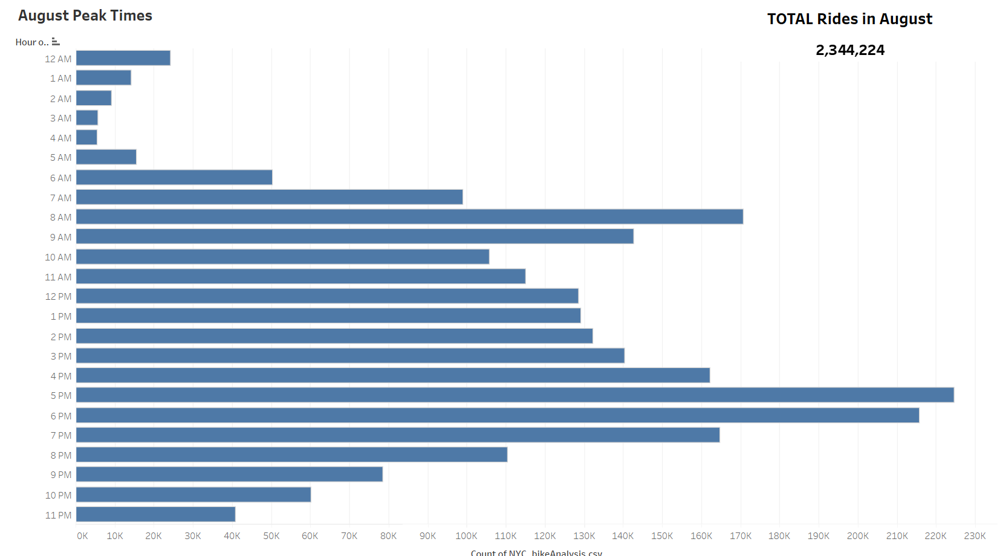
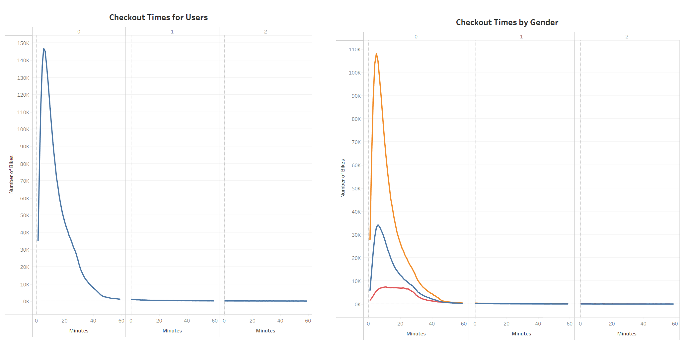
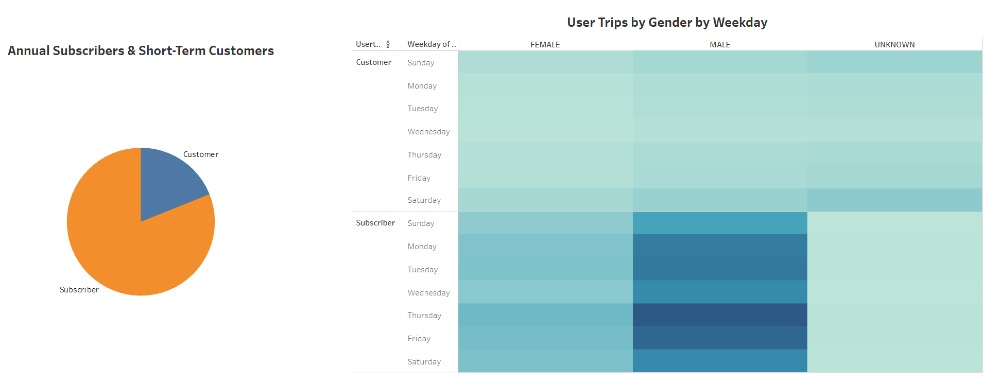
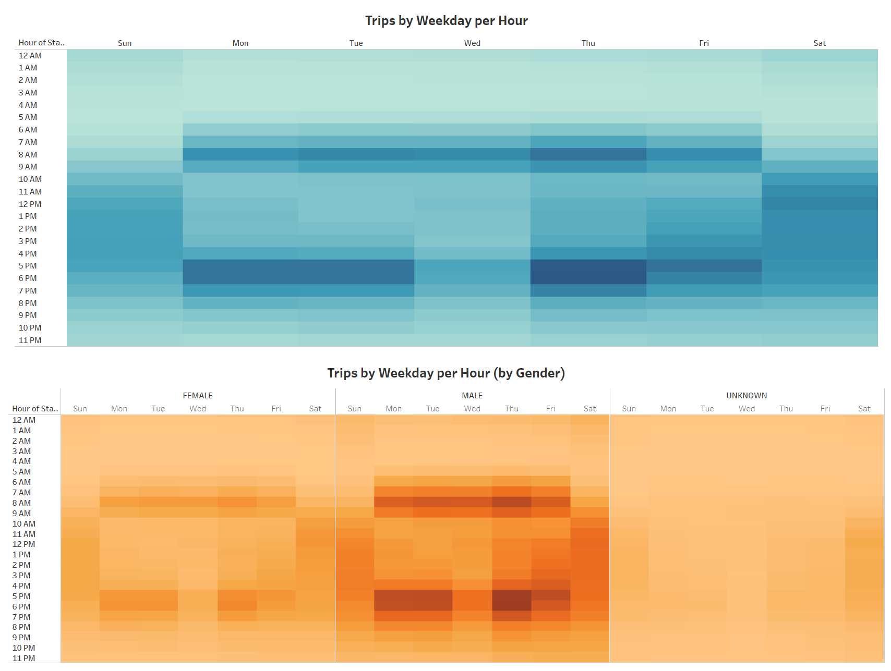

# bikesharing
Module 15: Tableau

Deliverable #3

## Analysis Overview: 

Visuals created in Tableau were used to present a bike-sharing business opportunity in Des Moines, Iowa to potential investors. These visuals were based on relevant data obtained from an existing bike share program in New York. The purpose of this proposal is to assist potential investors in evaluating the viability of the bike-sharing business opportunity and determining whether it is worth pursuing.

## Results:

- August Peak Times
- TOTAL Rides in August

*By looking at the number of rides taken in NY during August can give the potential investors an idea of what to expect for Des Moines.*
*Since August is a popular time for bike rentals in NYC due to favorable weather conditions, we can use this as a reference point for Des Moines.*
*This information will give us a general idea of the potential success of a bike-sharing business in Des Moines.*

___

- Checkout Times for Users
- Checkout Times by Gender

*Duration of bike usage for all customers and separated by gender, if disclosed.*
*Although male customers make up the majority of bike renters, the rental duration trend is consistent across all genders: most rentals last 30 minutes or less.*

___

- Annual Subscribers & Short-Term Customers
- Trips by Weekday per Hour (by Gender)

*The frequency of bike trips during the week was analyzed by gender, with a focus on both annual subscribers and customers, including an undisclosed population.*
*The bike share program is used more frequently by annual subscribers than by short-term customers, particularly on weekdays.*
*Among the annual subscribers, males are the primary users of rented bikes.*

___

- Trips by Weekday per Hour
- Trips by Weekday per Hour (by Gender)

*Peak bike rental times are concentrated on weekdays (Monday through Friday) from 7:00 AM to 9:00 AM and 5:00 PM to 7:00 PM, for both genders. However, given the larger population of male riders, they tend to dominate these peak times. Additionally, there is a consistent level of bike rental activity on Saturdays between 10:00 AM and 7:00 PM.*

My [Tableau Story](https://public.tableau.com/views/Module15Challengebikesharing/Story1?:language=en-US&publish=yes&:display_count=n&:origin=viz_share_link).

## Summary: 

The visualizations offer a broad overview of potential customers in Des Moines, based on New York data that identifies bike usage by gender, subscriber status, non-subscriber status, and peak rental days and times. While the visuals are a useful starting point, gathering additional data on factors such as weather, income levels, age groups, tourism patterns, and community classifications (such as urban, suburban, and rural) would be necessary for potential investors to make a more informed decision about the risks and opportunities associated with a bike-sharing business in Des Moines.
